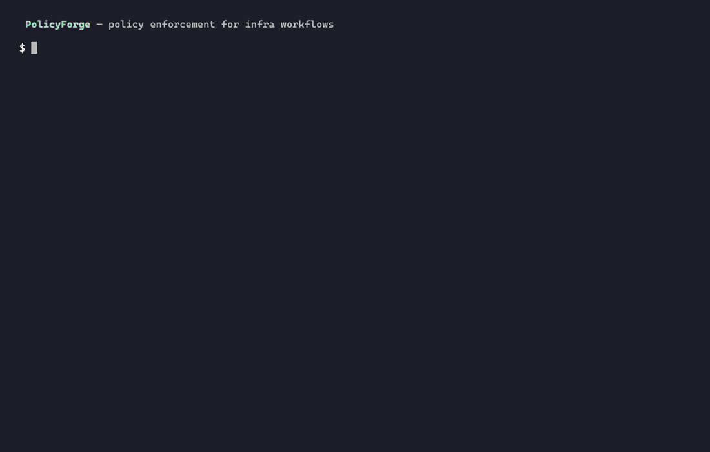
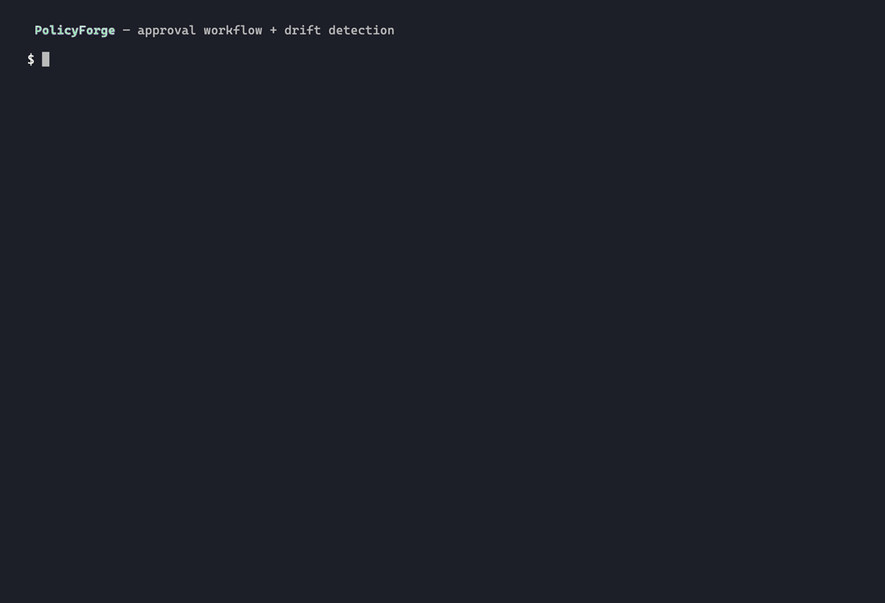
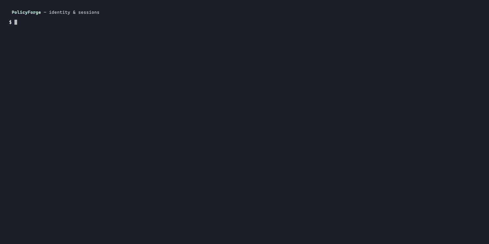

# PolicyForge

[](https://github.com/texasbe2trill/policyforge/actions/workflows/ci.yml)
[](https://goreportcard.com/report/github.com/texasbe2trill/policyforge)
[](https://pkg.go.dev/github.com/texasbe2trill/policyforge)
[](https://go.dev/)
[](LICENSE)

A policy-as-code engine for infrastructure access control. Define roles, resources, and safety tiers in YAML. PolicyForge evaluates requests and returns `allow`, `deny`, or `require_approval` — with tamper-evident audit logs, compliance evidence bundles, and drift detection built in.

**No external dependencies. No database. Just Go and a YAML file.**

⭐ If this project is useful or interesting, consider giving it a star — it helps others discover it.

---

## Why This Exists

Infrastructure teams need a way to enforce access rules that is auditable, deterministic, and doesn't require a complex policy runtime. PolicyForge answers the question: *"Can this identity perform this action on this resource at this automation tier?"* — and produces a compliance-ready evidence trail for every answer.

---

## Key Features

| Feature | Description |
|---|---|
| **RBAC + Safety Tiers** | Roles define allowed actions, resources, and automation tiers. A `max_tier` cap triggers approval when exceeded. |
| **Agent Policy Envelopes** | Non-human identities (bots, CI, AI) operate inside envelopes that restrict scope independent of RBAC. |
| **Tamper-Evident Audit Log** | Every decision is appended to a SHA-256 hash-chained JSONL file. |
| **Evidence Bundles** | Each evaluation produces a compliance-ready JSON artifact with mapped controls (PCI-DSS). |
| **Approval Workflow** | `require_approval` decisions create persistent records you can approve or reject. |
| **Drift Detection** | Re-evaluates the audit log against the current policy to find decisions that would now be denied. |
| **Session-Backed Auth** | Bearer token and OIDC stub authentication with session lifecycle management. |
| **Agent TTL Enforcement** | Agent sessions expire after a configurable window — denied before engine evaluation. |
| **CLI + API Parity** | Both interfaces use the same evaluation pipeline and produce identical outputs. |

---

## Design Themes

This project demonstrates:

- **Policy engine design** — deterministic evaluation with structured deny/approval/allow reasons
- **Hash-chained audit logs** — tamper detection without a database
- **Layered authorization** — RBAC + agent envelopes + safety tier caps
- **Compliance automation** — evidence bundles with automatic control mapping
- **Session security** — TTL enforcement, revocation, identity override to prevent escalation
- **Drift detection** — post-hoc analysis of policy changes against historical decisions
- **CLI/API parity** — shared service layer guarantees identical behavior

---




**Approval workflow + drift detection:**



**Identity & sessions — bearer token auth, session revocation, debug OIDC:**



---

## Quick Start

```bash
git clone https://github.com/texasbe2trill/policyforge.git
cd policyforge
go test ./...
```

Run three scenarios:

```bash
# Allow — viewer reads staging
go run ./cmd/policyforge --policy ./configs/policy.yaml \
  --subject alice --role viewer --resource staging/payment-service \
  --action read --tier read_only

# Deny — viewer attempts restart
go run ./cmd/policyforge --policy ./configs/policy.yaml \
  --subject alice --role viewer --resource staging/payment-service \
  --action restart --tier read_only

# Require approval — operator restarts prod
go run ./cmd/policyforge --policy ./configs/policy.yaml \
  --subject chris --role operator --resource prod/payment-service \
  --action restart --tier supervised_write
```

Or run the bundled demo scripts via Make:

```bash
make demo-cli    # runs scripts/demo.sh
make demo-api    # runs scripts/demo-api.sh
```

These are Make targets, not standalone files. They do not require VHS. If `jq` is installed the JSON output is pretty-printed; otherwise the scripts fall back to raw JSON.

---

## Policy Packs

Ready-to-use policy configurations for common scenarios in [`examples/policy-packs/`](examples/policy-packs/):

| Pack | Use Case |
|---|---|
| `pci-demo.yaml` | PCI-DSS-aligned environment with strict prod controls |
| `prod-sre.yaml` | SRE team with tiered escalation |
| `ci-agent.yaml` | CI/CD pipeline agents with narrow, time-boxed permissions |
| `breakglass-admin.yaml` | Emergency access with mandatory approval on every action |

```bash
cp examples/policy-packs/pci-demo.yaml configs/policy.yaml
go run ./cmd/policyforge --policy configs/policy.yaml --drift-check
```

---

## Sample Outputs

Static examples of every response type are in [`docs/samples/`](docs/samples/):

- [`allow-response.json`](docs/samples/allow-response.json) — Clean pass
- [`deny-response.json`](docs/samples/deny-response.json) — Hard deny with reason
- [`approval-response.json`](docs/samples/approval-response.json) — Soft gate requiring approval
- [`drift-findings.json`](docs/samples/drift-findings.json) — Drift detection finding
- [`evidence-bundle.json`](docs/samples/evidence-bundle.json) — Full compliance evidence bundle

---

## Bring Your Own Policy

```
go run ./cmd/policyforge [flags]
```

| Flag                  | Default                    | Description                                                             |
|-----------------------|----------------------------|-------------------------------------------------------------------------|
| `--policy`            | `configs/policy.yaml`      | Path to the policy YAML file                                            |
| `--input`             | *(none)*                   | Path to a JSON request file. Overrides all individual request flags.    |
| `--subject`           | *(required if no --input)* | Identity making the request                                             |
| `--role`              | *(required if no --input)* | Role assigned to the subject                                            |
| `--resource`          | *(required if no --input)* | Resource being accessed                                                 |
| `--action`            | *(required if no --input)* | Action being performed                                                  |
| `--tier`              | *(required if no --input)* | Requested safety tier                                                   |
| `--auto-approve`      | `false`                    | Converts a `require_approval` decision to `allow`                       |
| `--agent`             | *(none)*                   | Agent envelope name to apply on top of RBAC                             |
| `--drift-check`       | *(flag)*                   | Scan audit log for policy drift and exit                                |
| `--list-approvals`    | *(flag)*                   | Print all approval records and exit                                     |
| `--approve-id`        | *(none)*                   | Approve a pending request by approval ID                                |
| `--reject-id`         | *(none)*                   | Reject a pending request by approval ID                                 |
| `--decided-by`        | *(none)*                   | Name of person making the approval decision                             |
| `--decision-note`     | *(none)*                   | Optional note for the approval decision                                 |
| `--list-sessions`     | *(flag)*                   | Print all sessions from `artifacts/sessions.json` and exit              |
| `--revoke-session-id` | *(none)*                   | Revoke the session with the given ID and exit                           |
| `--version`           | *(flag)*                   | Print version and exit                                                  |

### Using flags directly

```bash
go run ./cmd/policyforge \
  --policy ./configs/policy.yaml \
  --subject alice \
  --role auditor \
  --resource prod/api-gateway \
  --action read \
  --tier read_only
```

### Using a JSON input file (recommended for scripting)

```bash
go run ./cmd/policyforge --policy ./configs/policy.yaml --input ./examples/request.json
```

### When required fields are missing

```
2026/04/04 18:31:31 invalid CLI request: missing required request fields: subject, resource, action, requested_tier
```

---

## Agent Policy Envelopes

An **agent** is a non-human identity — a remediation bot, CI pipeline, AI system, or any automated workflow. Because agents act autonomously, they operate inside a **policy envelope** that further restricts what they may do, on top of normal RBAC.

If a request includes an `agent` field, **both** the role-based checks and the envelope checks must pass. Failing either returns a `deny` or `require_approval`.

### Envelope definition

Envelopes live in `configs/policy.yaml` under `agent_envelopes`:

```yaml
agent_envelopes:
  - name: "remediation-bot"
    allowed_resources:
      - "staging/*"          # wildcard: matches any staging/ resource
    allowed_actions:
      - "read"
      - "restart"
    max_tier: "autonomous_write"
    session_ttl_minutes: 30

  - name: "prod-operator-bot"
    allowed_resources:
      - "prod/payment-service"
    allowed_actions:
      - "read"
    max_tier: "read_only"
    session_ttl_minutes: 15
```

`allowed_resources` supports `prefix/*` wildcard patterns. `max_tier` caps the envelope independently of the role's own cap.

### CLI usage

```bash
# allow: remediation-bot restarts staging resource within its envelope
go run ./cmd/policyforge \
  --policy ./configs/policy.yaml \
  --subject bot \
  --role operator \
  --resource staging/payment-service \
  --action restart \
  --tier read_only \
  --agent remediation-bot
```

```json
{
  "decision": "allow",
  "reasons": ["allow: all policy checks passed"],
  "timestamp": "2026-04-05T00:25:51Z",
  "request_id": "req-1775348751231064000",
  "matched_resource": "staging/payment-service",
  "evaluated_role": "operator"
}
```

```bash
# deny: remediation-bot tries to access a prod resource (outside its staging/* envelope)
go run ./cmd/policyforge \
  --policy ./configs/policy.yaml \
  --subject bot \
  --role operator \
  --resource prod/payment-service \
  --action read \
  --tier read_only \
  --agent remediation-bot
```

```json
{
  "decision": "deny",
  "reasons": ["deny: agent 'remediation-bot' is not allowed to access resource 'prod/payment-service'"],
  "timestamp": "2026-04-05T00:25:51Z",
  "request_id": "req-1775348751288228000",
  "matched_resource": "prod/payment-service",
  "evaluated_role": "operator"
}
```

```bash
# deny: prod-operator-bot tries to restart (only 'read' is in its envelope)
go run ./cmd/policyforge \
  --policy ./configs/policy.yaml \
  --subject bot \
  --role operator \
  --resource prod/payment-service \
  --action restart \
  --tier read_only \
  --agent prod-operator-bot
```

```json
{
  "decision": "deny",
  "reasons": ["deny: agent 'prod-operator-bot' cannot perform action 'restart'"],
  "timestamp": "2026-04-05T00:26:04Z",
  "request_id": "req-1775348764835152000",
  "matched_resource": "prod/payment-service",
  "evaluated_role": "operator"
}
```

### API usage

Include `agent` in the JSON body:

```bash
curl -X POST http://localhost:8080/evaluate \
  -H "Content-Type: application/json" \
  -d '{
    "subject": "bot",
    "role": "operator",
    "resource": "staging/payment-service",
    "action": "restart",
    "requested_tier": "read_only",
    "agent": "remediation-bot"
  }'
```

### Using a JSON input file

```bash
go run ./cmd/policyforge --policy ./configs/policy.yaml --input ./examples/request-agent.json
```

---

## REST API

PolicyForge ships a second entrypoint, `cmd/policyforge-api`, that exposes the same evaluation logic over HTTP.

### Start the server

```bash
go run ./cmd/policyforge-api --policy ./configs/policy.yaml
# 2026/04/05 00:06:36 policyforge-api listening on :8080
```

Or with a custom address:

```bash
go run ./cmd/policyforge-api --addr :9090
```

### Endpoints

| Method | Path               | Description                                |
|--------|--------------------|--------------------------------------------|
| `GET`  | `/health`          | Returns `{"status":"ok"}` when ready       |
| `POST` | `/evaluate`        | Evaluates a decision request               |
| `GET`  | `/sessions`        | List all sessions (admin role required)    |
| `POST` | `/sessions/revoke` | Revoke a session by ID (admin role required) |

### POST /evaluate

Request body is the same schema as a JSON input file:

```bash
curl -X POST http://localhost:8080/evaluate \
  -H "Content-Type: application/json" \
  -d '{
    "subject": "chris",
    "role": "operator",
    "resource": "prod/payment-service",
    "action": "restart",
    "requested_tier": "supervised_write"
  }'
```

```json
{
  "decision": "require_approval",
  "reasons": [
    "approval: resource 'prod/payment-service' requires approval",
    "approval: tier 'supervised_write' requires approval"
  ],
  "timestamp": "2026-04-05T00:06:38Z",
  "request_id": "req-1775347598162694000",
  "matched_resource": "prod/payment-service",
  "evaluated_role": "operator"
}
```

Pass `?auto_approve=true` to convert a `require_approval` decision to `allow`:

```bash
curl -X POST "http://localhost:8080/evaluate?auto_approve=true" \
  -H "Content-Type: application/json" \
  -d '{"subject":"chris","role":"operator","resource":"prod/payment-service","action":"restart","requested_tier":"supervised_write"}'
```

When the query parameter is used, the response includes `"auto-approved via query parameter"` in the reasons list.

Every API request produces an audit log entry and evidence bundle, identical to the CLI.

---

## Authentication

By default the API runs **unauthenticated** (backward compatible). Pass `--tokens` to enable bearer-token auth:

```bash
go run ./cmd/policyforge-api \
  --policy ./configs/policy.yaml \
  --tokens ./configs/tokens.yaml
```

### tokens.yaml format

```yaml
tokens:
  - token: "dev-admin-token"
    subject: "chris"
    role: "admin"
    auth_type: "local_token"

  - token: "operator-token"
    subject: "alex"
    role: "operator"
    auth_type: "local_token"

  - token: "agent-remediation-token"
    subject: "policyforge-agent"
    agent: "remediation-bot"
    role: "operator"
    auth_type: "agent_token"
```

### Bearer token usage

Pass the token in the `Authorization` header:

```bash
curl -X POST http://localhost:8080/evaluate \
  -H "Authorization: Bearer dev-admin-token" \
  -H "Content-Type: application/json" \
  -d '{
    "resource": "prod/payment-service",
    "action": "restart",
    "requested_tier": "supervised_write"
  }'
```

When auth is enabled, `subject`, `role`, and `agent` are **always sourced from the token** — request body identity fields are overridden. This prevents callers from escalating their own privileges.

### Debug OIDC mode

For local development without a real OIDC provider, set the environment variable `POLICYFORGE_ENABLE_DEBUG_OIDC=true`. This enables the `X-Debug-OIDC-Subject` and `X-Debug-OIDC-Role` request headers as an auth path:

```bash
POLICYFORGE_ENABLE_DEBUG_OIDC=true go run ./cmd/policyforge-api \
  --policy ./configs/policy.yaml --tokens ./configs/tokens.yaml

# Then from another terminal:
curl -X POST http://localhost:8080/evaluate \
  -H "X-Debug-OIDC-Subject: chris" \
  -H "X-Debug-OIDC-Role: admin" \
  -H "Content-Type: application/json" \
  -d '{"resource":"staging/payment-service","action":"read","requested_tier":"read_only"}'
```

> **Never enable debug OIDC in production.** The env var is intentionally verbose to make accidental enablement obvious.

### Session endpoints (admin only)

When auth is enabled, two session-management endpoints are available:

| Method | Path               | Description                                |
|--------|--------------------|-----------------------------------------|
| `GET`  | `/sessions`        | List all sessions (admin role required)    |
| `POST` | `/sessions/revoke` | Revoke a session by ID (admin role required) |

```bash
# List all sessions
curl -H "Authorization: Bearer dev-admin-token" http://localhost:8080/sessions

# Revoke a session
curl -X POST http://localhost:8080/sessions/revoke \
  -H "Authorization: Bearer dev-admin-token" \
  -H "Content-Type: application/json" \
  -d '{"session_id": "<id>"}'
```

Non-admin requests to these endpoints return `403 Forbidden`.

---

## Sessions

Every authenticated request is backed by a **session** — a persistent record stored in `artifacts/sessions.json`.

### Session lifecycle

1. First request with a valid token → a new session is created with an `issued_at` timestamp and TTL.
2. Subsequent requests with the same token → the existing active session is reused (no new row per request).
3. A revoked session → all future requests with that token return `401 Unauthorized`.

### Session record fields

```json
{
  "session_id": "sess-1775400000000000000",
  "subject": "chris",
  "role": "admin",
  "auth_type": "local_token",
  "issued_at": "2026-04-05T00:00:00Z",
  "expires_at": "2026-04-05T01:00:00Z",
  "status": "active"
}
```

| Field        | Description                                      |
|--------------|--------------------------------------------------|
| `session_id` | Unique ID for this session                       |
| `subject`    | Authenticated user or service identity           |
| `role`       | Role at session creation time                    |
| `auth_type`  | `local_token`, `oidc_stub`, or `agent_token`     |
| `issued_at`  | RFC3339 timestamp the session was created        |
| `expires_at` | RFC3339 timestamp when the session expires       |
| `status`     | `active`, `expired`, or `revoked`                |

### Default TTLs

| Auth type     | Default TTL |
|---------------|-------------|
| Human token   | 60 minutes  |
| Agent token   | 30 minutes (or `session_ttl_minutes` from envelope) |

### CLI session commands

```bash
# List all sessions
go run ./cmd/policyforge --list-sessions

# Revoke a specific session
go run ./cmd/policyforge --revoke-session-id sess-1775400000000000000
```

---

## Agent Session TTL Enforcement

Agent sessions have a time-bound window controlled by `session_ttl_minutes` in the agent envelope:

```yaml
agent_envelopes:
  - name: "remediation-bot"
    session_ttl_minutes: 30   # deny after 30 minutes from session issued_at
```

When an agent request arrives via the API with a valid token, the evaluator checks whether `time.Since(session.IssuedAt) > TTL`. If the TTL is exceeded, the request is **denied immediately** — before engine evaluation:

```json
{
  "decision": "deny",
  "reasons": ["deny: agent session for 'remediation-bot' exceeded TTL"],
  "timestamp": "2026-04-05T00:35:00Z",
  "request_id": "req-1775349300000000000"
}
```

To continue, the operator must revoke the old session and re-authenticate (re-request with the token, which creates a fresh session).

---

## Policy Configuration

Policies are defined in `configs/policy.yaml`. The file has three sections.

### Safety Tiers

Tiers define the level of automation. Each tier can optionally require approval.

```yaml
safety_tiers:
  - name: "read_only"
    requires_approval: false   # read operations, no approval needed
  - name: "supervised_write"
    requires_approval: true    # writes require human sign-off
  - name: "autonomous_write"
    requires_approval: false   # fully automated, granted to admins only
```

### Roles

Each role defines what actions, tiers, and resources it can access. `max_tier` caps the automation level a role can use autonomously — requesting above it triggers `require_approval` regardless of other tier settings.

```yaml
roles:
  - name: "admin"
    allowed_actions: ["read", "write", "restart", "scale"]
    allowed_tiers:   ["read_only", "supervised_write", "autonomous_write"]
    max_tier:        "autonomous_write"
    allowed_resources:
      - "prod/payment-service"
      - "prod/api-gateway"
      - "staging/payment-service"

  - name: "operator"
    allowed_actions: ["read", "restart", "scale"]
    allowed_tiers:   ["read_only", "supervised_write"]
    max_tier:        "supervised_write"
    allowed_resources:
      - "prod/payment-service"
      - "staging/payment-service"

  - name: "auditor"
    allowed_actions: ["read"]
    allowed_tiers:   ["read_only"]
    max_tier:        "read_only"
    allowed_resources:
      - "prod/payment-service"
      - "prod/api-gateway"
      - "staging/payment-service"

  - name: "viewer"
    allowed_actions: ["read"]
    allowed_tiers:   ["read_only"]
    max_tier:        "read_only"
    allowed_resources:
      - "staging/payment-service"
```

### Resources

Resources declare which infrastructure targets exist, and whether accessing them inherently requires approval.

```yaml
resources:
  - name: "prod/payment-service"
    requires_approval: true    # production — always require approval
  - name: "prod/api-gateway"
    requires_approval: true    # production — always require approval
  - name: "staging/payment-service"
    requires_approval: false   # staging — safe to allow directly
```

---

## Decision Logic

The engine evaluates every request against the same deterministic sequence of checks. The first failing check stops evaluation and returns immediately.

| # | Check | Failing outcome |
|---|-------|-----------------|
| 1 | Role exists in policy | `deny` |
| 2 | Action is in role's `allowed_actions` | `deny` |
| 3 | Resource exists in policy | `deny` |
| 4 | Resource is in role's `allowed_resources` | `deny` |
| 5 | Requested tier exists in policy | `deny` |
| 6 | Requested tier is in role's `allowed_tiers` | `deny` |
| 7 | Requested tier does not exceed role's `max_tier` | `require_approval` |
| 8 | Agent envelope: exists, resource allowed, action allowed, tier ≤ max | `deny` / `require_approval` |
| 9 | Resource `requires_approval: false` and tier `requires_approval: false` | `require_approval` |
| — | All checks pass | `allow` |

**Reason messages are structured** so they are easy to parse:
- `deny: ...` for hard failures
- `approval: ...` for soft gates
- `allow: ...` for clean passes

---

## Decision Response Schema

Every response is a JSON object printed to stdout:

```json
{
  "decision": "allow | deny | require_approval",
  "reasons": ["structured reason message"],
  "timestamp": "2026-04-04T23:41:52Z",
  "request_id": "req-1775346112600030000",
  "matched_resource": "staging/payment-service",
  "evaluated_role": "viewer"
}
```

| Field              | Description                                      |
|--------------------|--------------------------------------------------|
| `decision`         | Outcome: `allow`, `deny`, or `require_approval`  |
| `reasons`          | Ordered list explaining the decision             |
| `timestamp`        | RFC3339 UTC time the decision was made           |
| `request_id`       | Unique ID for this evaluation (also in audit log)|
| `matched_resource` | Resource name resolved from policy               |
| `evaluated_role`   | Role name resolved from policy                   |

### Scenario outputs

**Scenario A — allow** (`examples/request-allow.json`):
Viewer reads staging payment service with `read_only` tier.

```json
{
  "decision": "allow",
  "reasons": [
    "allow: all policy checks passed"
  ],
  "timestamp": "2026-04-04T23:41:52Z",
  "request_id": "req-1775346112600030000",
  "matched_resource": "staging/payment-service",
  "evaluated_role": "viewer"
}
```

**Scenario B — deny** (`examples/request-deny-action.json`):
Viewer attempts restart, which is not in their `allowed_actions`.

```json
{
  "decision": "deny",
  "reasons": [
    "deny: action 'restart' is not allowed for role 'viewer'"
  ],
  "timestamp": "2026-04-04T23:41:52Z",
  "request_id": "req-1775346112640457000",
  "matched_resource": "staging/payment-service",
  "evaluated_role": "viewer"
}
```

**Scenario C — require_approval + auto-approve** (`examples/request-require-approval.json` with `--auto-approve`):
Operator restarts prod payment service via `supervised_write`. Both resource and tier require approval. `--auto-approve` converts the decision to `allow`.

```json
{
  "decision": "allow",
  "reasons": [
    "approval: resource 'prod/payment-service' requires approval",
    "approval: tier 'supervised_write' requires approval",
    "auto-approved via CLI flag"
  ],
  "timestamp": "2026-04-04T23:41:52Z",
  "request_id": "req-1775346112679835000",
  "matched_resource": "prod/payment-service",
  "evaluated_role": "operator"
}
```

---

## Audit Logging

Every evaluation — regardless of outcome — is appended to `artifacts/audit.jsonl` in [JSON Lines](https://jsonlines.org/) format. The directory is created automatically.

Each line is a single JSON object:

```jsonl
{"request_id":"req-1775346112600030000","timestamp":"2026-04-04T23:41:52Z","subject":"alex","role":"viewer","resource":"staging/payment-service","action":"read","decision":"allow","reasons":["allow: all policy checks passed"]}
{"request_id":"req-1775346112640457000","timestamp":"2026-04-04T23:41:52Z","subject":"pat","role":"viewer","resource":"staging/payment-service","action":"restart","decision":"deny","reasons":["deny: action 'restart' is not allowed for role 'viewer'"]}
```

Each record includes a `hash` (SHA-256 of the key fields) and a `previous_hash` that chains each entry to the one before it. This makes undetected modification of the log difficult — any change to a record invalidates its hash and breaks the chain.

The audit log is append-only. It is never overwritten by the CLI or API. To query it:

```bash
# view the last 10 decisions
tail -n 10 artifacts/audit.jsonl

# filter for denials only
grep '"decision":"deny"' artifacts/audit.jsonl

# filter for a specific subject
grep '"subject":"chris"' artifacts/audit.jsonl

# pretty-print a single entry
tail -n 1 artifacts/audit.jsonl | jq .
```

---

## Evidence Bundles

Every evaluation — CLI or API — writes a compliance-ready JSON file to `artifacts/evidence/<bundle_id>.json`. The directory is created automatically.

Each bundle captures the full context of the decision:

```json
{
  "bundle_id": "ev_1775347598163202000_97651",
  "request_id": "req-1775347598162694000",
  "timestamp": "2026-04-05T00:06:38Z",
  "decision": "require_approval",
  "subject": "chris",
  "role": "operator",
  "resource": "prod/payment-service",
  "action": "restart",
  "requested_tier": "supervised_write",
  "reasons": [
    "approval: resource 'prod/payment-service' requires approval",
    "approval: tier 'supervised_write' requires approval"
  ],
  "controls": [
    "PCI-DSS-7.2",
    "PCI-DSS-10.2"
  ]
}
```

### Compliance controls

Controls are mapped automatically from the request context:

| Condition | Control |
|---|---|
| Resource path contains `prod` | `PCI-DSS-7.2` |
| Action is `restart`, `write`, or `scale` | `PCI-DSS-10.2` |
| Decision is `deny` | `SECURITY-ENFORCEMENT` |

---

## Approval Persistence

When a request evaluates to `require_approval`, PolicyForge now creates a persisted approval record in `artifacts/approvals.json`. This turns the soft gate into a real workflow — you can list pending approvals, approve them, or reject them.

### How it works

1. A `require_approval` decision creates a record with `status: pending`
2. `--auto-approve` creates the record with `status: approved` immediately
3. A human reviewer uses `--approve-id` or `--reject-id` to resolve it

### Submit a request that requires approval

```bash
go run ./cmd/policyforge \
  --policy ./configs/policy.yaml \
  --input ./examples/request-require-approval.json
```

```
Approval required -- approval ID: apr-1775349830126355000
{
  "decision": "require_approval",
  ...
}
```

### List pending approvals

```bash
go run ./cmd/policyforge --list-approvals
# or:
make approvals
```

```json
[
  {
    "approval_id": "apr-1775349830126355000",
    "request_id": "req-1775349830121985000",
    "status": "pending",
    "subject": "chris",
    "role": "operator",
    "resource": "prod/payment-service",
    "action": "restart",
    "requested_tier": "supervised_write",
    "reasons": ["approval: resource 'prod/payment-service' requires approval"],
    "requested_at": "2026-04-05T00:06:38Z"
  }
]
```

### Approve a request

```bash
go run ./cmd/policyforge \
  --approve-id apr-1775349830126355000 \
  --decided-by chris \
  --decision-note "approved for emergency maintenance"
```

```json
{"approved": "apr-1775349830126355000", "decided_by": "chris"}
```

### Reject a request

```bash
go run ./cmd/policyforge \
  --reject-id apr-1775349830126355000 \
  --decided-by security-team \
  --decision-note "insufficient justification"
```

Approval records are stored in `artifacts/approvals.json` and are linked to their evidence bundles via `approval_id`.

---

## Drift Detection

Drift detection re-evaluates every record in the audit log against the **current** policy. If a request was previously `allow`ed but today's policy would `deny` or `require_approval` it, that's a finding.

This answers the question: *"Has our policy tightened since these decisions were made? Are there any past actions that would no longer be permitted?"*

### Run drift detection

```bash
go run ./cmd/policyforge \
  --policy ./configs/policy.yaml \
  --drift-check
# or:
make drift
```

Findings are written to `artifacts/drift/findings.json` and printed to stdout.

### No drift found

```json
{"findings": [], "summary": "no drift detected"}
```

### Drift findings example

```json
[
  {
    "finding_id": "drift-1775349830126355000",
    "timestamp": "2026-04-05T01:00:00Z",
    "request_id": "req-1775346112600030000",
    "subject": "alice",
    "role": "viewer",
    "resource": "staging/payment-service",
    "action": "restart",
    "requested_tier": "read_only",
    "observed_decision": "allow",
    "expected_decision": "deny",
    "severity": "high",
    "drift_type": "unauthorized_action",
    "message": "request was allowed but current policy would deny: deny: action 'restart' is not allowed for role 'viewer'"
  }
]
```

### Drift types

| `drift_type` | Meaning |
|---|---|
| `decision_mismatch` | Policy outcome changed but no specific violation |
| `unauthorized_resource_access` | Role no longer allowed to access this resource |
| `unauthorized_action` | Action no longer in role's `allowed_actions` |
| `agent_envelope_violation` | Agent envelope no longer permits the action/resource |
| `tier_exceeded` | Tier request exceeds current role `max_tier` |

### Severity

| Severity | Condition |
|---|---|
| `high` | Was `allow`, current policy would `deny` |
| `medium` | Was `allow`, current policy would `require_approval` |
| `low` | Any other mismatch |

---

## Approval Flow

When a decision is `require_approval` the CLI prints a notification line to stderr and writes the JSON response to stdout:

```
Approval required -- approval ID: apr-1775349830126355000
{ ... }
```

Pass `--auto-approve` to immediately convert the decision to `allow` and append the reason `auto-approved via CLI flag` to the response. The audit log records the final outcome (`allow`), preserving all original approval reasons alongside it.

```bash
go run ./cmd/policyforge \
  --policy ./configs/policy.yaml \
  --input ./examples/request-require-approval.json \
  --auto-approve
```

---

## Project Structure

```
policyforge/
├── cmd/
│   ├── policyforge/
│   │   └── main.go             # CLI entry point
│   └── policyforge-api/
│       ├── main.go             # HTTP API entry point
│       └── handler_test.go     # API handler tests
├── internal/
│   ├── approval/               # Approval CRUD with JSON persistence
│   ├── audit/                  # Append-only JSONL logger with hash chain
│   ├── auth/                   # Bearer token auth, OIDC stub, middleware
│   ├── compliance/             # PCI-DSS control mapping
│   ├── config/                 # YAML policy + JSON request loaders
│   ├── drift/                  # Post-hoc drift detection
│   ├── evidence/               # Evidence bundle generation + CSV index
│   ├── policy/                 # Deterministic evaluation engine
│   ├── service/                # Shared evaluation pipeline (CLI + API)
│   ├── session/                # Session lifecycle management
│   ├── types/                  # Shared domain types
│   └── version/                # Version constant
├── configs/
│   ├── policy.yaml             # Default policy
│   └── tokens.yaml             # Token definitions (for auth mode)
├── examples/
│   ├── policy-packs/           # Ready-to-use policy configurations
│   └── *.json                  # Request examples
├── docs/
│   ├── architecture.md         # System diagram and package breakdown
│   ├── overview.md             # Project overview
│   └── samples/                # Static sample outputs
├── scripts/
│   ├── demo.sh                 # CLI demo script
│   └── demo-api.sh             # API demo script
├── artifacts/                  # Runtime outputs (gitignored)
├── Makefile
├── CONTRIBUTING.md
├── ROADMAP.md
├── SECURITY.md
└── README.md
```

## Architecture

See [docs/architecture.md](docs/architecture.md) for the full system diagram and package breakdown.

```
Request → Auth → Identity Override → Agent TTL Check → Policy Engine → Decision
                                                                        ├→ Audit Log (hash-chained)
                                                                        ├→ Evidence Bundle
                                                                        └→ Approval Record
```

---

## Development

```bash
make test       # run all tests
make lint       # go vet + gofmt check
make build      # build binaries to bin/
make version    # print current version
make fmt        # format all Go files
make vet        # run go vet
make demo-cli   # runs scripts/demo.sh
make demo-api   # runs scripts/demo-api.sh
make drift      # run drift detection
make approvals  # list pending approvals
make sessions   # list sessions
```

`make demo-cli` and `make demo-api` are scripted walkthroughs. Use `make api` or `make api-auth` when you want to start a long-running API server yourself.

### Start the API server

```bash
make api           # unauthenticated
make api-auth      # with bearer token auth
```

Or directly:

```bash
go build -o bin/policyforge ./cmd/policyforge
go build -o bin/policyforge-api ./cmd/policyforge-api
```

### Format and vet

```bash
go fmt ./...
go vet ./...
```

### Re-record the demos

Requires [VHS](https://github.com/charmbracelet/vhs) (`brew install vhs`):

```bash
make demo             # vhs demo.tape            → artifacts/demo.gif
make demo-approvals   # vhs demo-approvals.tape  → artifacts/demo-approvals.gif
```

| Tape | What it shows |
|------|--------------|
| `demo.tape` | Core evaluation: allow, deny, require\_approval (auto), agent deny, audit log, evidence bundle |
| `demo-approvals.tape` | Approval workflow + drift detection: submit → list → approve → drift check |
| `demo-auth.tape` | Identity & sessions: bearer token auth, 401 enforcement, session list, revoke, debug OIDC |

### Testing strategy

All logic is covered by table-driven tests in `internal/policy/engine_test.go` and `internal/config/request_test.go`. When adding new engine checks or policy fields, add a corresponding test case before committing.

---

## Dependencies

- [`gopkg.in/yaml.v3`](https://pkg.go.dev/gopkg.in/yaml.v3) — YAML parsing

---

## License

MIT License. See [LICENSE](LICENSE).

---

## Support

If PolicyForge is useful to you, consider supporting development:

[](https://buymeacoffee.com/texasbe2trill)
[](https://github.com/sponsors/texasbe2trill)
