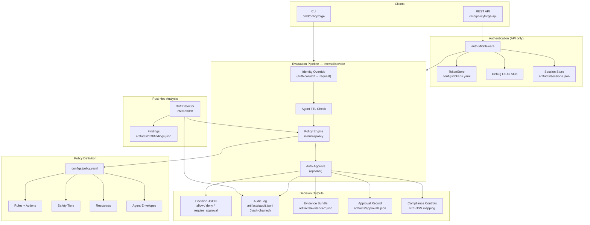

# Architecture

PolicyForge is structured as a layered evaluation pipeline. Both the CLI and REST API share the same code path through `internal/service.Evaluate`, guaranteeing identical behaviour regardless of interface.

## System Diagram



## Package Responsibilities

| Package | Role |
|---|---|
| `cmd/policyforge` | CLI entry point — flag parsing, JSON/flag request building, mode dispatch |
| `cmd/policyforge-api` | HTTP server — routes, request decoding, auth middleware wiring |
| `internal/policy` | Deterministic evaluation engine — role, action, resource, tier, and agent envelope checks |
| `internal/service` | Shared evaluation pipeline — identity override, TTL, engine call, audit, evidence, approvals |
| `internal/auth` | Bearer-token auth, debug OIDC stub, context-based identity propagation |
| `internal/session` | Session lifecycle — create, find active, validate, revoke, list |
| `internal/approval` | Approval CRUD — create pending, approve, reject, list |
| `internal/audit` | Append-only JSONL logger with SHA-256 hash chaining |
| `internal/evidence` | Compliance-ready evidence bundle generation with CSV index |
| `internal/drift` | Post-hoc drift detection — re-evaluate audit log against current policy |
| `internal/compliance` | Control mapping (PCI-DSS-7.2, PCI-DSS-10.2, SECURITY-ENFORCEMENT) |
| `internal/config` | YAML policy loader, JSON request loader with field validation |
| `internal/types` | Shared domain types — Policy, DecisionRequest, Decision, AuditRecord |
| `internal/version` | Version constant |

## Data Flow

### Evaluation (CLI or API)

1. **Input** — Request arrives as CLI flags, JSON file, or HTTP POST body.
2. **Auth** (API only) — Middleware authenticates via bearer token or OIDC stub, creates/reuses a session, and attaches `Identity` to the request context.
3. **Identity Override** — If auth context is present, `subject`, `role`, and `agent` from the token replace whatever was in the request body. This prevents privilege escalation.
4. **Agent TTL Check** — If the request has an agent with a session, `time.Since(session.IssuedAt)` is compared against the envelope's `session_ttl_minutes`. Exceeded → immediate `deny`.
5. **Policy Engine** — Sequential checks: role exists → action allowed → resource exists → resource allowed → tier exists → tier allowed → max tier cap → agent envelope → approval requirements.
6. **Auto-Approve** (optional) — Converts `require_approval` to `allow` with an added reason.
7. **Outputs** — Decision JSON is returned to the caller. In parallel: audit record is appended (hash-chained), evidence bundle is written, approval record is created (if applicable), compliance controls are mapped.

### Drift Detection

1. Load all records from `artifacts/audit.jsonl`.
2. For each record, reconstruct the original `DecisionRequest` and re-evaluate against the **current** policy.
3. Compare the original decision to the new one. If the current policy is stricter (e.g. was `allow`, now `deny`), emit a finding with severity and drift type.
4. Write findings to `artifacts/drift/findings.json`.

## Artifact Layout

```
artifacts/
├── audit.jsonl                  # Append-only, hash-chained decision log
├── approvals.json               # Pending and resolved approval records
├── sessions.json                # Session lifecycle records
├── drift/
│   └── findings.json            # Drift detection output
└── evidence/
    ├── index.csv                # CSV index of all bundles
    └── ev_<id>.json             # Individual evidence bundles
```

All artifacts are auto-created on first use. The `artifacts/` directory is typically gitignored except for the `policyforge` binary placeholder.
